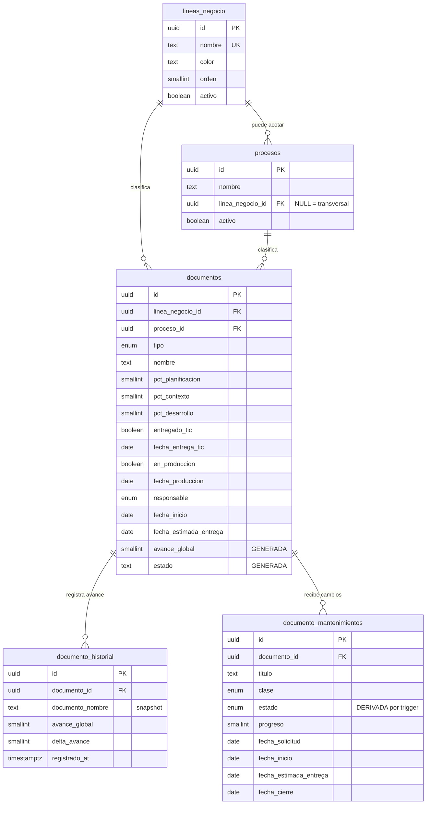

# Diccionario de datos — Módulo Documentos

> Branch `Act`. Este módulo **agrega** objetos nuevos. Las tablas `activities` y `projects` del módulo de agenda quedan intactas en Supabase.
>
> Script: [`supabase/migrations/20260831000000_documentos.sql`](../../supabase/migrations/20260831000000_documentos.sql)

## Modelo relacional



## Decisiones de diseño

| Decisión | Por qué |
|---|---|
| `avance_global` y `estado` son **columnas generadas** | El porcentaje global y el estado nunca se editan a mano, así que no pueden desincronizarse de las fases. Un `UPDATE` de un slider recalcula todo en Postgres. |
| Catálogos con **borrado lógico** (`deleted_at`) y FK `on delete restrict` | Borrar una empresa no puede dejar documentos huérfanos ni reescribir el histórico. |
| Índices únicos **parciales** (`where deleted_at is null`) | Se puede volver a usar un nombre después de dar de baja el registro anterior. |
| `procesos.linea_negocio_id` **nullable** | Un proceso como "Compras" existe en varias empresas; `NULL` lo marca transversal en vez de duplicarlo por empresa. |
| Redundancia **solo** en `documento_historial` | Es una tabla de movimientos: congela la foto del momento. En `documentos` no hay redundancia porque renombrar una empresa **sí** debe propagarse. |
| Fecha de entrega normalizada por trigger | El front solo manda el booleano; la BD garantiza que "entregado" y "fecha de entrega" nunca queden en desacuerdo. |

## Fórmula del avance global

```
avance_global = round( planificación × 0.20
                     + contexto      × 0.20
                     + desarrollo    × 0.40
                     + (entregado_tic ? 100 : 0) × 0.10
                     + (en_produccion ? 100 : 0) × 0.10 )
```

Los dos hitos finales valen 10% cada uno, así que un documento **nunca llega a 100%** hasta que está corriendo en producción: entregarlo a TIC lo deja en 90%. Terminar de construir algo que todavía nadie usa no es haber terminado, y esa diferencia es justo la que hay que poder ver.

## Estados derivados

| Condición | Estado |
|---|---|
| `en_produccion = true` | **En producción** |
| `entregado_tic = true` | **Entregada a TIC** |
| `pct_desarrollo = 100` | **Lista para TIC** |
| `pct_desarrollo > 0` | **En desarrollo** |
| `pct_contexto > 0` | **En contexto** |
| `pct_planificacion > 0` | **En planificación** |
| resto | **Sin iniciar** |

---

## `lineas_negocio` — empresas del grupo

| Campo | Tipo | Restricciones | Descripción de negocio |
|---|---|---|---|
| `id` | `uuid` | PK, default `gen_random_uuid()` | Identificador único. |
| `nombre` | `text` | NOT NULL, único entre vivas, no vacío | Nombre de la empresa o línea de negocio. |
| `color` | `text` | NOT NULL, default `#1067f2`, formato `#rrggbb` | Color con el que la empresa aparece en los gráficos del dashboard. Mantiene consistencia visual entre todas las visualizaciones. |
| `orden` | `smallint` | NOT NULL, default `0` | Orden manual de presentación en listas y filtros. |
| `activo` | `boolean` | NOT NULL, default `true` | Si es `false` deja de ofrecerse en el formulario pero sus documentos históricos siguen visibles. |
| `created_at` / `updated_at` | `timestamptz` | NOT NULL | Auditoría. `updated_at` lo mantiene un trigger. |
| `deleted_at` | `timestamptz` | NULL | Borrado lógico. Nunca se borra físicamente. |
| `created_by_id` | `text` | NULL | Quién creó el registro. |

## `procesos` — departamentos o procesos

| Campo | Tipo | Restricciones | Descripción de negocio |
|---|---|---|---|
| `id` | `uuid` | PK | Identificador único. |
| `nombre` | `text` | NOT NULL, no vacío | Nombre del proceso o departamento (Talento Humano, Compras…). |
| `linea_negocio_id` | `uuid` | FK → `lineas_negocio`, NULL | Empresa a la que pertenece. **`NULL` = proceso transversal**, disponible para todas las empresas. |
| `activo` | `boolean` | NOT NULL, default `true` | Controla si aparece en el formulario. |
| `created_at` / `updated_at` / `deleted_at` / `created_by_id` | — | — | Auditoría estándar. |

Índice único: `(lower(nombre), coalesce(linea_negocio_id, uuid_cero))` entre registros vivos. El `coalesce` es necesario porque en SQL `NULL <> NULL` y sin él se podrían crear dos procesos transversales con el mismo nombre.

## `documentos` — tabla principal

| Campo | Tipo | Restricciones | Descripción de negocio |
|---|---|---|---|
| `id` | `uuid` | PK | Identificador único. |
| `linea_negocio_id` | `uuid` | NOT NULL, FK → `lineas_negocio` | **Línea de Negocio**: para qué empresa del grupo es el documento. |
| `proceso_id` | `uuid` | NOT NULL, FK → `procesos` | **Proceso**: departamento o proceso al que sirve. |
| `tipo` | `documento_tipo` | NOT NULL | **Tipo** de entregable: `App`, `Dashboard`, `Forms`, `Excel`, `Script`. |
| `nombre` | `text` | NOT NULL, no vacío | **Nombre del Documento**: cómo se llama el entregable. |
| `descripcion` | `text` | NULL | Detalle opcional del alcance. |
| `pct_planificacion` | `smallint` | NOT NULL, 0–100, default 0 | % de **planificación**: definición de alcance, requerimientos y cronograma. |
| `pct_contexto` | `smallint` | NOT NULL, 0–100, default 0 | % de **contexto**: levantamiento de información con el área, reglas de negocio y datos fuente. |
| `pct_desarrollo` | `smallint` | NOT NULL, 0–100, default 0 | % de **desarrollo**: construcción efectiva del entregable. |
| `entregado_tic` | `boolean` | NOT NULL, default `false` | Si el documento ya fue **entregado al área de TIC**. |
| `fecha_entrega_tic` | `date` | NULL, coherente con el booleano | Fecha de la entrega. La rellena y la limpia un trigger; el front solo manda el booleano. |
| `responsable` | `responsable_enfoque` | NULL | **Enfoque**: quién está trabajando el documento (`Juan` = azul, `Valentina` = rosado). `NULL` = sin asignar. |
| `avance_global` | `smallint` | **GENERADA**, solo lectura | Porcentaje global ponderado. Ver fórmula arriba. |
| `estado` | `text` | **GENERADA**, solo lectura | Estado derivado de los porcentajes. Ver tabla arriba. |
| `fecha_inicio` | `date` | NOT NULL, default hoy | **Cuándo se empezó a trabajar de verdad.** La escribe el usuario desde el formulario; el default solo sirve de arranque. No es la fecha de registro —esa es `created_at`— porque casi nunca coinciden. De aquí salen los días en curso. |
| `fecha_estimada_entrega` | `date` | NULL, `>= fecha_inicio` | **Fecha estimada de entrega**: para cuándo se comprometió. `NULL` = sin fecha pactada, y entonces el documento no entra en el semáforo de vencimientos. No participa en el cálculo del avance: es el plazo, no el progreso. |
| `created_at` / `updated_at` / `deleted_at` / `created_by_id` | — | — | Auditoría estándar. |

Restricción clave: `documentos_entrega_coherente` impide guardar un documento marcado como entregado sin fecha, o con fecha sin estar entregado.

`documentos_estimada_posterior_inicio` impide prometer una entrega para antes de haber arrancado. El formulario valida lo mismo antes de enviar, para que el usuario vea un mensaje en español en vez del error de Postgres.

## `documento_mantenimientos` — cambios sobre lo ya entregado

Un cambio sobre algo que ya está en producción no es un documento nuevo: es una fila colgada del documento existente. El padre conserva su avance; estos registros no lo modifican.

| Campo | Tipo | Restricciones | Descripción de negocio |
|---|---|---|---|
| `id` | `uuid` | PK | Identificador único. |
| `documento_id` | `uuid` | NOT NULL, FK → `documentos`, `on delete cascade` | Documento del que cuelga. |
| `titulo` | `text` | NOT NULL, no vacío | Qué se pidió. |
| `descripcion` | `text` | NULL | Contexto, quién lo pidió, condiciones. |
| `clase` | `mantenimiento_clase` | NOT NULL, default `Mejora` | `Correctivo` (algo se rompió), `Mejora` (piden algo nuevo encima), `Actualización` (técnico, sin cambio funcional visible). |
| `progreso` | `smallint` | NOT NULL, 0–100, default 0 | **Avance del mantenimiento.** Es la fuente de verdad del estado. |
| `estado` | `mantenimiento_estado` | NOT NULL, **derivada por trigger** | `Abierto` / `En curso` / `Cerrado`. No se edita a mano: la recalcula `mantenimientos_normalizar_cierre()` en cada escritura. |
| `responsable` | `responsable_enfoque` | NULL | Quién lo está trabajando. |
| `fecha_solicitud` | `date` | NOT NULL, default hoy | **Cuándo lo pidieron.** |
| `fecha_inicio` | `date` | NULL | **Cuándo empezamos a trabajarlo.** `NULL` = todavía no. Tenerla ya basta para que el estado pase a `En curso`. |
| `fecha_estimada_entrega` | `date` | NULL, `>= fecha_inicio` | Para cuándo se comprometió. |
| `fecha_cierre` | `date` | Coherente con el estado | La pone y la limpia el trigger al llegar (o dejar de estar) al 100%. |
| `created_at` / `updated_at` / `deleted_at` / `created_by_id` | — | — | Auditoría estándar. |

Reglas del trigger, en orden:

| Situación | Estado |
|---|---|
| `progreso >= 100` | **Cerrado** — se rellena `fecha_cierre`, y `fecha_inicio` si estaba vacía |
| `progreso > 0` **o** `fecha_inicio is not null` | **En curso** |
| resto | **Abierto** |

> Es un trigger `BEFORE` y no una columna generada porque `estado` ya existía como columna normal, con su enum, su índice parcial y su restricción de coherencia con `fecha_cierre`. Convertirla en generada obligaría a tirar la columna y todo lo que cuelga de ella sin ganar nada: el efecto para la aplicación es idéntico.

## `documento_historial` — bitácora de avance

Una fila por cada cambio de porcentaje o de entrega. La escribe **exclusivamente** el trigger `tg_documentos_historial`; la aplicación solo tiene permiso de lectura.

| Campo | Tipo | Descripción de negocio |
|---|---|---|
| `documento_id` | `uuid` FK | Documento al que pertenece el movimiento. `on delete cascade`. |
| `documento_nombre`, `linea_negocio_nombre`, `proceso_nombre`, `tipo`, `responsable` | — | **Snapshot inmutable**: congela cómo se llamaban las cosas en ese momento. Si mañana la empresa cambia de nombre, el histórico sigue siendo fiel. |
| `pct_planificacion`, `pct_contexto`, `pct_desarrollo`, `entregado_tic` | `smallint` / `boolean` | Valores en el instante del cambio. |
| `avance_global`, `estado` | — | Derivados en el instante del cambio. |
| `delta_avance` | `smallint` | Puntos ganados (o perdidos) respecto al registro anterior. Permite graficar velocidad sin funciones de ventana. |
| `registrado_at` | `timestamptz` | Momento del cambio. |

---

## Vistas

| Vista | Para qué sirve |
|---|---|
| `v_documentos_detalle` | Modelo de lectura principal del front. Documentos vivos con nombres de catálogo ya resueltos y las métricas calculadas: `dias_en_curso`, `dias_sin_movimiento`, `estancado` (más de 21 días sin tocarse y sin entregar), `dias_para_entrega` (con signo: positivo quedan días, 0 vence hoy, negativo se pasó) y `entrega_vencida`. Los dos últimos los calcula Postgres contra `current_date`, no el navegador, para que la aplicación y el reporte impreso no discrepen por la zona horaria del equipo. |
| `v_mantenimientos_detalle` | Modelo de lectura de los mantenimientos vivos. Añade `dias_para_entrega`, `entrega_vencida` y `dias_en_curso` (desde la fecha de inicio real contra hoy; `NULL` mientras no se haya empezado). |
| `v_resumen_linea_negocio` | Consolidado por empresa: total, entregados, en curso, sin iniciar y avance promedio. |
| `v_resumen_proceso` | Consolidado por departamento, ordenado por carga. Responde "¿qué área nos consume más?". |
| `v_resumen_tipo` | Consolidado por tipo de entregable. Responde "¿qué estamos construyendo realmente?". |

## Seguridad

RLS activo en las cuatro tablas. Políticas permisivas para `anon` y `authenticated`, consistentes con el módulo de agenda existente, que ya escribe desde el navegador con la *publishable key*.

`documento_historial` es la excepción: **solo lectura** desde la aplicación. Las inserciones las hace el trigger `documentos_registrar_historial()`, declarado `SECURITY DEFINER` para que corra con los privilegios de su propietario.

> Ese `SECURITY DEFINER` no es opcional. Los triggers son `SECURITY INVOKER` por defecto, es decir que ejecutan con el rol de quien llama (`anon`); como la tabla no le concede INSERT, la RLS bloqueaba al propio trigger y hacía fallar todo guardado de documento con `42501`, que Supabase devuelve como **401**. La alternativa —dar política de INSERT a `anon`— resolvería el error pero permitiría que la aplicación fabricara historial falso.

> Si más adelante se agrega login de Supabase, basta cambiar `anon` por `authenticated` en las políticas de escritura del script.
